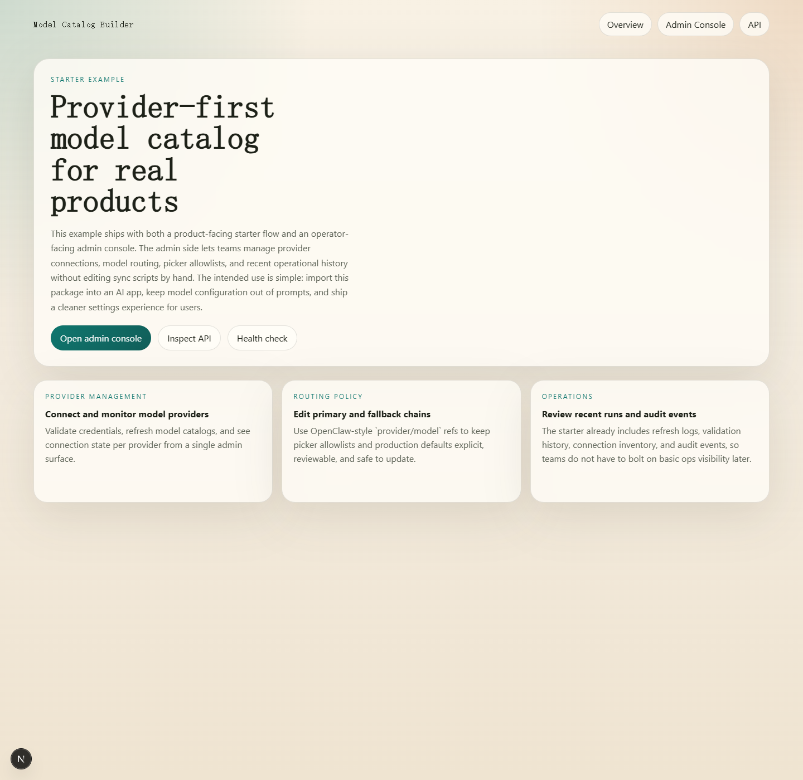
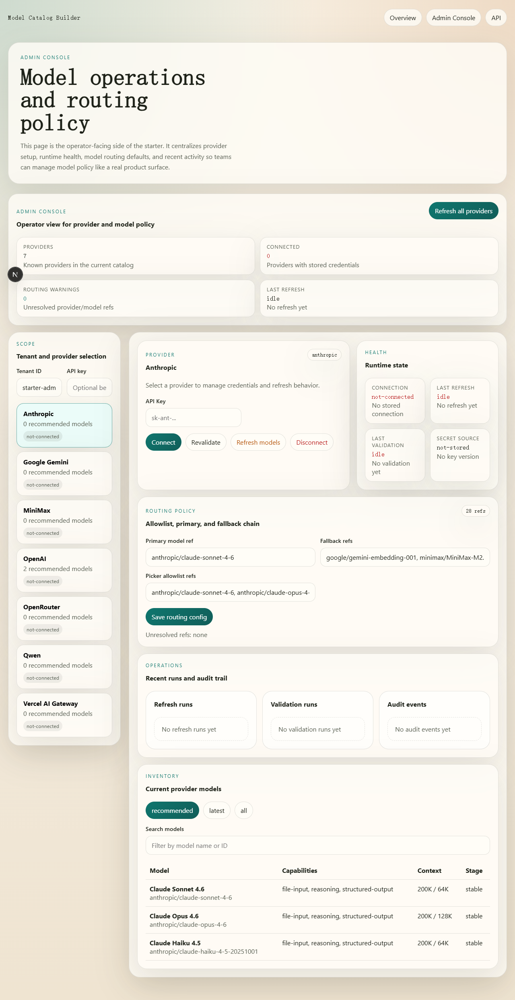
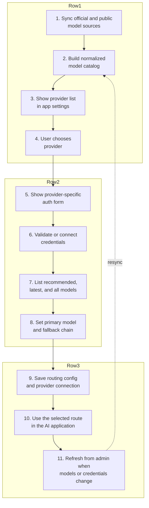

# Model-catlog-builder

An embeddable LLM configuration starter for AI applications.

This repository helps developers stop hardcoding provider lists, model IDs, and fallback logic inside their apps. It gives you a provider-first model catalog, an OpenClaw-style routing layer, starter APIs, a demo server, and a Next.js starter app with an admin console.

## Current Status

This project is at the **MVP** stage.

What that means today:

- It already works as a reusable package and starter for Node.js and Next.js AI applications.
- It already supports real provider/model configuration flows instead of static JSON prompts.
- It has already been validated in one real application integration.
- It is best suited for solo developers and small product teams that want to add model configuration to an existing AI app quickly.

What it is not yet:

- a universal enterprise control plane
- a zero-customization package for every stack
- a finished platform for every provider or deployment model

## Screenshots

### Starter landing page



### Admin console



## Configuration Flow



## What You Get

### 1. Provider-first setup

Define which providers your product exposes and how each one should be configured.

- provider registry
- provider-specific auth fields
- setup help text
- discovery strategy per provider

### 2. Normalized model catalog

Sync model availability and metadata into one app-friendly structure instead of exposing raw upstream JSON directly to your frontend or agent.

- provider list
- model list
- recommended/latest/all groups
- normalized metadata such as context, pricing, capabilities, and source

### 3. Model routing config

Use an OpenClaw-style configuration model for defaults and fallback behavior.

- `provider/model` refs
- `primary`
- `fallbacks`
- `allowlist`
- auth profile order metadata

### 4. Starter API

Use the included API surface instead of re-implementing provider and model config endpoints from scratch.

- list providers
- get provider setup
- validate credentials
- connect / revalidate / disconnect
- list models
- refresh models
- get / update model routing config
- health and runtime endpoints

### 5. Starter UI

Use the demo server or the Next.js example to get a working provider/model configuration experience fast.

- landing page
- `/admin` console
- provider connection flow
- routing configuration editor
- recent validation / refresh / audit views

## Quick Start

Install dependencies:

```bash
npm install
```

Generate a normalized catalog:

```bash
npm run sync:catalog -- \
  --output output/model-catalog.generated.json \
  --registry assets/provider-registry.template.json \
  --overrides assets/catalog-overrides.template.json
```

Generate the routing config:

```bash
npm run init:model-routing -- --providers openai,anthropic,google
```

Run the demo server:

```bash
npm run demo
```

Then open [http://localhost:4177](http://localhost:4177).

## Fastest Ways To Use It

### Option 1: Generate a standalone starter app

Best for developers who want a full working base with API + UI.

```bash
npm run scaffold:next -- ./my-model-catalog-app --name my-model-catalog-app
```

Useful scaffold options:

- `--template full`
- `--template api-only`
- `--providers global | china | minimal | all`
- `--providers openai,anthropic,openai-compatible`
- `--deploy vercel | render | none`
- `--multi-tenant`
- `--api-auth`

Example:

```bash
npm run scaffold:next -- ./china-api --template api-only --providers china --deploy render --multi-tenant --api-auth
```

### Option 2: Embed the starter API into an existing app

Best for teams that already have an AI app and only want to add provider/model configuration.

Start with:

- [references/integration-guide.md](./references/integration-guide.md)
- [references/api-contract.md](./references/api-contract.md)
- [assets/starter-api/index.mjs](./assets/starter-api/index.mjs)
- [assets/starter-api/createStarterApiService.mjs](./assets/starter-api/createStarterApiService.mjs)

### Option 3: Use only the config core

Best for teams that want to keep their own UI and runtime, but stop hardcoding model config.

Use:

- provider registry templates
- catalog sync script
- model routing config
- normalized catalog output

## Repository Map

- [SKILL.md](./SKILL.md): the full working guide for using this repo as a Codex skill
- [assets/](./assets): starter API files, config templates, and routing config assets
- [scripts/](./scripts): catalog sync, routing config generation, demo server, and scaffolding
- [examples/next-starter](./examples/next-starter): a runnable Next.js example with `/admin`
- [references/integration-guide.md](./references/integration-guide.md): shortest path for importing this into an existing app
- [references/deployment-playbook.md](./references/deployment-playbook.md): deployment and production notes

## Recommended Reading Order

If you are evaluating this project for adoption, read in this order:

1. [references/integration-guide.md](./references/integration-guide.md)
2. [references/api-contract.md](./references/api-contract.md)
3. [references/product-patterns.md](./references/product-patterns.md)
4. [references/deployment-playbook.md](./references/deployment-playbook.md)

If you want the full implementation guide, then read [SKILL.md](./SKILL.md).

## Environment Notes

The starter supports a local development fallback for secrets when `MODEL_CATALOG_SECRET` is not set. That makes local setup easy, but production deployments should always provide an explicit secret.

If these environment variables are present, catalog sync will use official provider model lists before public catalogs:

- `OPENAI_API_KEY`
- `ANTHROPIC_API_KEY`
- `GEMINI_API_KEY`

## MVP Scope

This repository currently focuses on one thing:

**helping developers import a complete model-configuration flow into their AI application faster**

That includes:

- provider selection
- provider-specific auth setup
- normalized model selection
- primary/fallback routing
- a basic admin workflow

It does not currently optimize for every product category or every provider-specific edge case.
